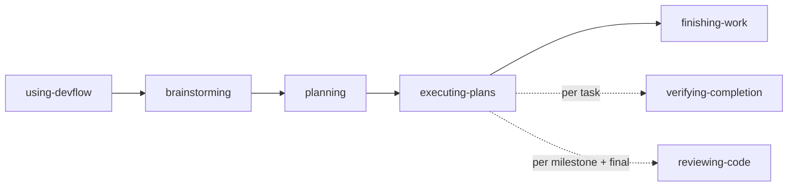

# dev-skills

Skills for AI coding assistants. The core is a tightly-coupled workflow chain for structured development (applicable to any task requiring analysis, planning, and systematic execution); standalone skills handle on-demand work like documentation governance.

## Philosophy

- **Concise**: Each skill is focused and minimal — no heavy checklists or verbose gates
- **Self-driving chain**: Workflow skills form an autonomous chain; each drives to the next without an orchestrator
- **Manual control**: Skills are user-triggered, not auto-injected via hooks

## Skills

The collection spans two categories: **workflow skills** that form a self-driving chain, and **standalone skills** invoked on demand.

### Workflow Skills

| Skill | Description |
|-------|-------------|
| `using-devflow` | Entry router — skill index, workflow orchestration, intent routing |
| `brainstorming` | Requirements → design → long-lived docs (Spec/PRD/ADR) |
| `planning` | Design doc → milestone-grouped task list + execution strategy (TDD decisions) |
| `executing-plans` | Serial milestone execution with checkpoint reviews |
| `test-driven-development` | Red-Green-Refactor cycle, invoked on-demand by executing-plans |
| `verifying-completion` | Run commands → see output → then claim completion |
| `reviewing-code` | Dispatch reviewer → structured report + handle feedback |
| `finishing-work` | Integration decision: merge, PR, keep, or discard |
| `systematic-debugging` | Root cause investigation → hypothesis → minimal fix |

### Standalone Skills

| Skill | Description |
|-------|-------------|
| `curating-docs` | Tame documentation chaos — survey, recommend convention, codify into AI config, reorganize structure, remediate content health |

## Default Workflow

using-devflow auto-drives the chain without per-step confirmations. `systematic-debugging` and `reviewing-code` can also be invoked independently.

## Acknowledgments

Inspired by [Superpowers](https://github.com/obra/superpowers).
