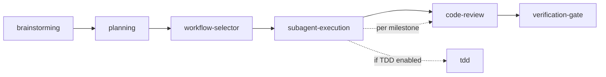

# Dev Flow

Entry router for the dev-skills system. Provides a skill index, orchestrates the default workflow chain, and routes user intent.

## Available Skills

| Skill | Trigger | Purpose |
|-------|---------|---------|
| `brainstorming` | "Design a feature", "Brainstorm X" | Requirements → design → long-lived docs |
| `planning` | "Create a plan", "Plan this feature" | Design doc → milestone-grouped task list |
| `workflow-selector` | "Select workflow", after planning | Choose TDD + Review strategy |
| `subagent-execution` | "Execute the plan", after workflow selection | Serial milestone execution with checkpoint reviews |
| `code-review` | "Review this code", "/review" | Pure review, produces structured report |
| `verification-gate` | "Am I done?", before merge | Run commands → verify output → claim complete |
| `tdd` | Invoked internally by subagent-execution | Red-Green-Refactor cycle |

## Default Workflow

When a user indicates they want to build something (new feature, significant change), guide them through this chain:

Each step asks the user whether to proceed to the next. No step is forced.

## Independent Invocation

Every skill can be invoked independently. Examples:
- User already has a clear design → skip brainstorming, go straight to `planning`
- User just wants code review → invoke `code-review` directly
- User wants to add tests → invoke `tdd` directly

## Routing Logic

When the user's intent is unclear, identify what stage they are at:

| User says | Route to |
|-----------|----------|
| "I want to build X", "Design a system for Y" | brainstorming |
| "Break this spec into tasks" | planning |
| "Should I use TDD?", "Let's start coding" | workflow-selector |
| "Execute the plan", "Start implementing" | subagent-execution |
| "Review my code", "Check this PR" | code-review |
| "Am I done?", "Is this ready?" | verification-gate |
| "I just want to write tests for this" | tdd |

## Tool Mapping

| Generic Term | Description |
|-------------|-------------|
| Skill invocation | Load and follow a specific skill's instructions |
| Read file | Read project files for context |
