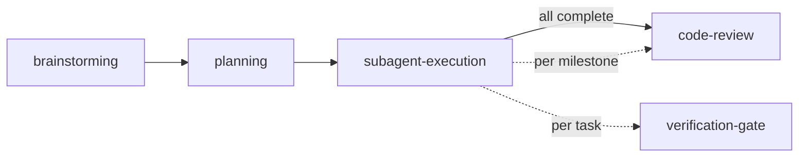

# Dev Flow

Entry orchestrator for the dev-skills system. Drives the full workflow chain automatically, or routes individual skills on demand.

## Available Skills

| Skill | Trigger | Purpose |
|-------|---------|---------|
| `brainstorming` | "Design a feature", "Brainstorm X" | Requirements → design → long-lived docs |
| `planning` | "Create a plan", "Plan this feature" | Design doc → milestone-grouped task list with execution strategy |
| `subagent-execution` | "Execute the plan", "Start implementing" | Serial milestone execution with checkpoint reviews |
| `code-review` | "Review this code", "/review" | Pure review, produces structured report |
| `verification-gate` | "Am I done?", before merge | Run commands → verify output → claim complete |
| `tdd` | Invoked internally by subagent-execution | Red-Green-Refactor cycle |

## Full Workflow Chain

## Orchestration Mode (auto-drive)

When the user triggers devflow or expresses intent to build something, execute the full chain automatically:

1. **Load brainstorming** — Discuss requirements, produce design, save docs if warranted.
2. **Load planning** — Decompose design into milestone-grouped task list with execution strategy.
3. **Load subagent-execution** — Execute milestones serially with checkpoint reviews.
4. **Done** — All tasks complete, final review done.

**Rules:**
- Move through the chain **without asking** the user to confirm each transition.
- Load the next skill immediately after the current one completes.
- The user can interrupt at any time — say "stop", "skip to planning", "just do X", etc.
- If the user is already at a specific stage (e.g., they have a design doc ready), start from that stage.

## Routing (when intent is unclear)

When the user's request doesn't explicitly name a skill:

| User says | Route to |
|-----------|----------|
| "I want to build X", "Design a system for Y" | brainstorming (start of chain) |
| "Break this spec into tasks", "Plan this feature" | planning |
| "Execute the plan", "Start implementing" | subagent-execution |
| "Review my code", "Check this PR" | code-review |
| "Am I done?", "Is this ready?" | verification-gate |
| "I just want to write tests for this" | tdd |

## Tool Mapping

| Generic Term | Description |
|-------------|-------------|
| Skill invocation | Load and follow a specific skill's instructions |
| Read file | Read project files for context |
