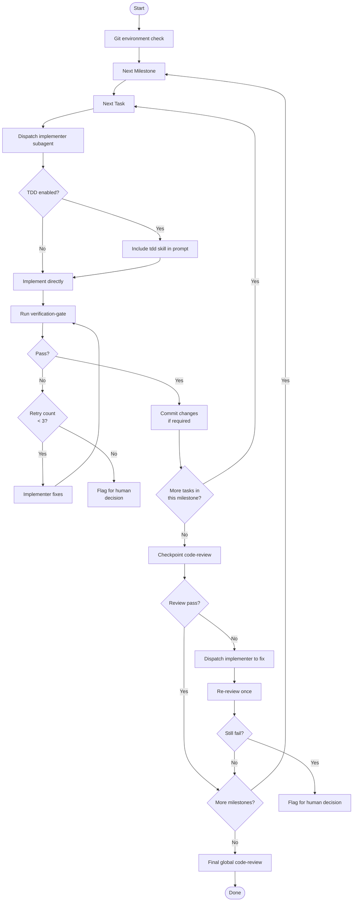

# Subagent Execution

Execute the implementation plan by dispatching implementer subagents for each task, running checkpoint reviews between milestones, and a final global review.

## Preconditions

Before starting, you must have:
1. **Planning output** — milestone-grouped task list with dependency annotations
2. **Workflow-selector decision** — which tasks use TDD, which don't

## Git Environment Check

Before starting execution, determine the commit strategy to avoid accumulating an uncommitted blob of changes:

1. Is this a git repository? Check: `git rev-parse --git-dir 2>/dev/null`

2. If **not a git repo**: Ask the user: "This is not a git repository. Do you want me to initialize one and commit as we go?"

3. If **is a git repo**, check whether this is a git worktree:
   - Run `git rev-parse --git-path HEAD` — if the `HEAD` file path is outside `.git/`, run `git worktree list` to confirm
   - Or check: `test -f .git && echo "worktree"` (worktrees have `.git` as a file, not a directory)

4. Commit strategy:

   | Environment | Strategy |
   |------------|----------|
   | **Git worktree** | Require a commit after **each task** completes. The implementer subagent must stage and commit their changes before returning. If a milestone groups multiple tasks, also commit after the milestone. |
   | **Main branch** (regular repo) | Ask the user: "You are on `main`. Should I create a feature branch and commit as we go, or proceed without commits?" |
   | **Feature branch** (regular repo, not worktree) | Ask the user: "Should I commit after each task, after each milestone, or do you prefer to commit yourself?" |
   | **Not a git repo** | Follow user's answer from step 2. |

5. **Rationale**: Committing per task or milestone produces a clean, reviewable history. Accumulating all changes into one big commit obscures the progression of the work and makes review and rollback harder.

## Scheduling Rules

**All tasks execute serially. Never dispatch multiple implementer subagents in parallel.**




## Implementer Subagent Prompt

Craft the implementer prompt with these elements:

```markdown
## Task
{task description with full context from plan}

## Relevant Context
{summary of the design/spec this task implements}
{paths to relevant existing files}
{codebase conventions or patterns to follow}

## Acceptance Criteria
- {criterion 1}
- {criterion 2}

## TDD Instructions (if enabled)
{Include the tdd skill instructions: red → green → refactor cycle}

## Commit Instructions (if enabled by git environment check)
{If commits are required: Stage all changed files, write a concise commit message summarizing the task, and commit before returning. Follow the existing commit message convention (check `git log --oneline` for the repo's style).}

## Output Requirements
- Complete the implementation
- Run verification (tests, lint, build)
- Commit changes (if required)
- Return: summary of changes + issues encountered + verification result + commit SHA (if committed)
```

### Prompt Crafting Principles

- **Essential context upfront**: subagent receives task description, design context, file paths, and acceptance criteria. It does NOT need to read the full plan/spec.
- **Self-gather for details**: the subagent should read source files, explore the codebase, and look up conventions on its own as needed. The parent does not need to pre-package every file.
- **Focused**: one clear task, not "fix everything"
- **Constrained**: specify what NOT to change if relevant
- **Specific output**: tell the subagent exactly what to return

## Handling Implementer Status

When an implementer subagent returns:

| Status | Action |
|--------|--------|
| **Done** | Proceed to verification-gate |
| **Needs context** | Provide the missing info (or point to the file to read) and re-dispatch. Do not pre-read and summarize unless the subagent explicitly needs interpretation |
| **Blocked** | Assess: missing context? task too large? plan wrong? — resolve or escalate |
| **Concerns raised** | Read concerns, address if critical, otherwise note and proceed |

Never ignore an implementer saying they are blocked. Something needs to change.

## Checkpoint Review

After a milestone completes:
1. Gather all changed files from the milestone's tasks
2. Dispatch code-review with scope = milestone changes + relevant spec
3. Review report: pass → next milestone; issues → fix loop (max one re-review)

## Final Global Review

After all milestones complete:
1. Gather all changes across the entire implementation
2. Dispatch code-review with scope = full diff + original spec
3. Review report: pass → ready to merge; issues → fix loop (max one re-review)

## Continuous Execution

Do not pause between tasks to check in with the user. Execute all tasks without stopping. Only pause when:
- BLOCKED status you cannot resolve
- Ambiguity that genuinely prevents progress
- All tasks complete

## Key Rules

- **Never parallel dispatch** implementer subagents
- **Always verification-gate** after each task before claiming complete
- **Never skip review** — checkpoint or final
- **Max one re-review loop** — flag for human after that
- **Subagents do not read the plan** — provide curated context, but subagents self-gather source files
- **Commit per task in git worktrees** — avoid accumulating uncommitted changes
- **Max 3 verification-gate retries** — if a task fails verification 3 times in a row, flag for human decision

## Tool Mapping

| Generic Term | Description |
|-------------|-------------|
| Dispatch subagent | Create an implementer subagent with isolated context |
| Task list | Manage structured to-do items (mark tasks complete) |
| Run command | Execute verification commands |
| Read file | Read plan file, design docs, existing source files |
| Edit file | N/A — subagent handles implementation |
